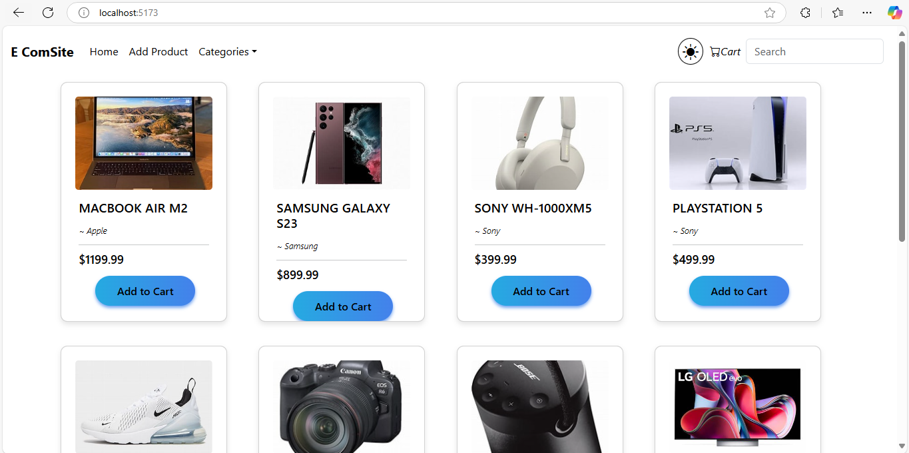
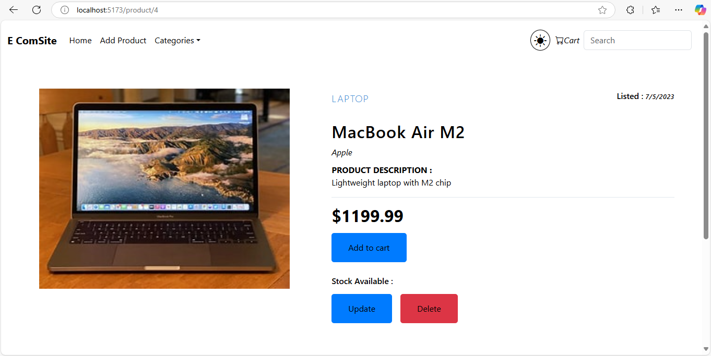
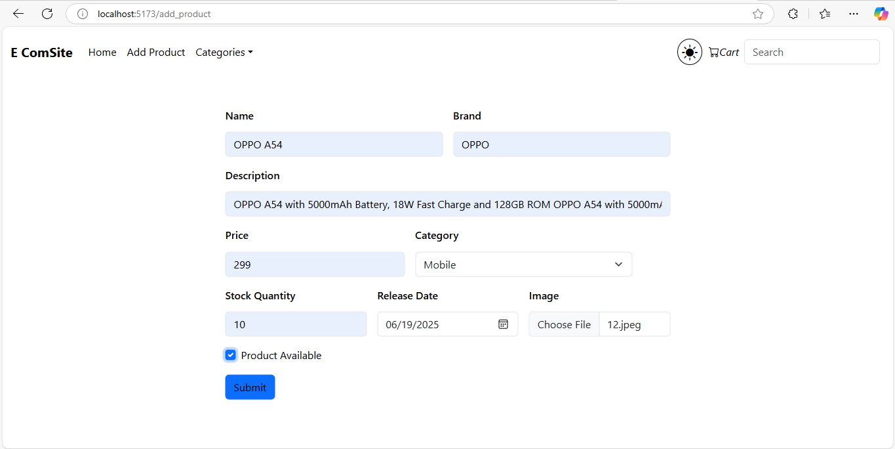
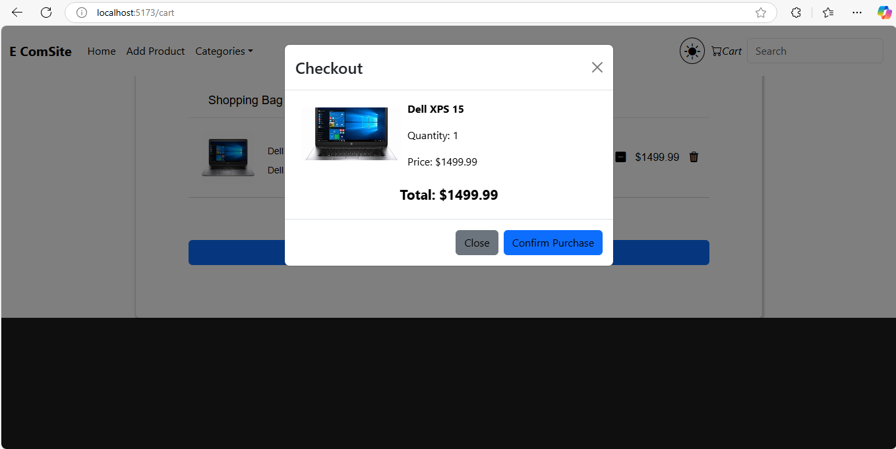

# E ComSite 🛒

A Simple E ComSite is a web-based e-commerce platform where users can browse and purchase products.

## Features
- 🛍️ Browse products by category
- 🛒 Add products to cart
- 🔄 Update and delete products

## Screenshots

### Home Page


### Product Page


### Add Product Page


### Checkout Page


## Technologies Used
- **Frontend**: React.js
- **Backend**: Spring Boot
- **Database**: MySQL

## Installation

1. **Clone the repository**:
   ```sh
   git clone https://github.com/mohamedshahban94/ProjectECom.git
   ```
2. **Navigate to the project folder**:
   ```sh
   cd ProjectECom
   ```
3. **Run the backend**:
   ```sh
   mvn spring-boot:run
   ```

## Contributing
Feel free to fork the repository and contribute!


